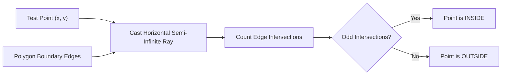

# Point-in-Polygon & Shoelace Engine Skill

Robust Jordan curve ray-casting and Shoelace cross-product formulation for polygon containment and geometrical properties.

## Features
- **100% Python Standard Library**: Pure analytical geometric intersection.
- **Shoelace Formula**: Area and center of mass in \(O(n)\) time.
